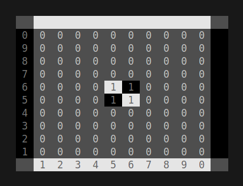
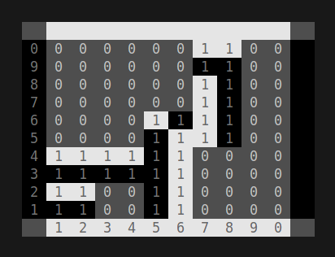
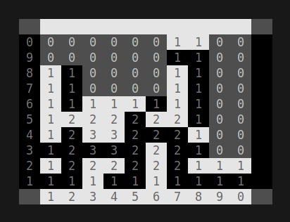

# BLINQ - PFL Project

**Blinq (Binary + link)** is a connection game that uses dual coloured square blocks composed of two rectangles and shared by both players.

Players alternate turns placing those blocks according to some simple stacking rules, each trying to connect the two sides of the board of her colour. Notice that on their turn, players play both colours at once, as the blocks are indivisible.

## Project Members

- Bruno Miguel Gonçalves Ferreira | up202207863@edu.fe.up.pt
- Pedro Miguel Silva Roleira Marinho | up202206854@edu.fe.up.pt

## Participation

- Each one of us did **50%** of the asked work. The `value` and `find_path` functions were made by both students and the rest of the functions were divided accordingly.

## Installation and Execution

1. Ensure that **SICStus Prolog 4.9** is installed.
2. Clone the repository or download the project files.
3. If there is a problem when loading assets, make sure to add the absolute path to `current_directory(_, 'your_path_here')` in `play/0`.
4. Open a terminal in the project directory.
5. Run the following command to load the game files:

```bash
sicstus -l src/game.pl
```

5. Finally execute the command bellow to start the game:

```bash
play.
```

## Description of the game

**Blinq (short for "Binary + Link")** is a two-player connection game. The game is played on a 5x5 board using dual-colored square blocks. Each block is composed of two rectangles, and both players share the same pieces. The objective is to connect the two opposite sides of the board corresponding to a player’s color. The game requires strategic placement and stacking of blocks to create a continuous path while preventing the opponent from completing theirs.

### Rules

1. Place the neutral block in the center space of the board (or any cell as a variant).
2. Each player is assigned a color (white or black) and receives half of the blocks.
3. Starting with White, players alternate turns placing one block on the board.
4. Blocks must be placed:

   - Parallel to the board lines.
   - Within a cell on the board when on the ground level.
   - On a 2x2 arrangement of blocks when placed on higher levels, centered on it.

5. The game ends when a player connects their two sides or resigns. If all pieces are used without a connection, the game ends in a draw.

### References

For a more detailed overview of the rulebook and gameplay mechanics, visit the following resources:

- [Blinq game](https://boardgamegeek.com/boardgame/271266/blinq)
- [Blinq PDF Rulebook](https://nestorgames.com/rulebooks/BLINQ_A5_EN.pdf)

## Considerations for game extensions

- **Visual indication of valid moves:** Displaying clearly which moves are possible for the player to make.

- **Move choice via keyboard or coordinates input:** Players can either choose their move using the keyboard or by entering the coordinates of the desired position. This provides flexibility in how players interact with the game.

- **Computer player with two difficulty levels:**
  1. **Easy (1):** The computer randomly selects its moves.
  2. **Hard (2):** The computer evaluates the game state and selects the best possible move based on greedy strategy.

## Game Logic

### Game Configuration Representation

The initial_state/2 predicate sets up the initial game configuration based on the mode and difficulty:

- **GameConfig**: `[GameMode, GameDifficulty]`

  - **GameMode**: Asserts one of these values **'player-player'**, a local game between two players, **'player-computer'**, a game between a player and a computer where the player starts first, **'computer-player'**, a game between a computer and a player where the computer starts first ,**'computer-computer'** , a game between two computers each with a given difficulty.

  - **GameDifficulty**: Asserts one of these values, **1** as the _easy_ difficulty computer, and **2** as the _hard_ difficulty computer. This is for modes involving a single computer.

  - For **'computer-computer'**: GameDifficulty for each is `Bot1Difficulty` and `Bot2Difficulty` (**1** or **2** for each).

- **GameState** Representation: `[Board, Player, 27, 27, ValidMoves]`

  - **Board**: Initial board matrix, with a special piece in the middle, and empty spaces around.

  - **Player**: First player, always starting as `'white'`.

  - **Board Pieces**: For each player, there are `27` pieces that they play with.

  - **Valid Moves**: Initial matrix, with pairs of the coordinates with the initial valid moves.

### Internal Game State Representation

- **Current board state:** The overall layout of the game board, including the positions of all pieces.
- **Player turn:** Indicates which player's turn it is (White or Black).
- **Number of white blocks left:** The remaining white blocks available for the player.
- **Number of black blocks left:** The remaining black blocks available for the player.
- **Current valid moves:** A list of all valid moves the current player can make.

#### Internal Representation:

- **White Player block:** Represented as `white`.
- **Black Player block:** Represented as `black`.
- **Block orientation:** Can be `1` or `2`, representing different orientations of a block.
- **Block size:** Each block has a size of `2x2` pieces.
- **Empty spaces:** Represented as `empty`, indicating locations on the board that are not occupied by any block or piece.
- **White Player pieces:** Represented as `white`, referring to the pieces controlled by the White Player.
- **Black Player pieces:** Represented as `black`, referring to the pieces controlled by the Black Player.
- **Piece height:** Each piece, in addition to its color, has a field for the **height**, which allows for stacking representation (i.e., indicating how many pieces are stacked in a particular location).

#### Example representations:

- Initial State:

```
[
[[empty,0],[empty,0],[empty,0],[empty,0],[empty,0],[empty,0],[empty,0],[empty,0], [empty,0],[empty,0]],
[[empty,0],[empty,0],[empty,0],[empty,0],[empty,0],[empty,0],[empty,0],[empty,0], [empty,0],[empty,0]],
[[empty,0],[empty,0],[empty,0],[empty,0],[empty,0],[empty,0],[empty,0],[empty,0], [empty,0],[empty,0]],
[[empty,0],[empty,0],[empty,0],[empty,0],[empty,0],[empty,0],[empty,0],[empty,0], [empty,0],[empty,0]],
[[empty,0],[empty,0],[empty,0],[empty,0],[white,1],[black,1],[empty,0],[empty,0], [empty,0],[empty,0]],
[[empty,0],[empty,0],[empty,0],[empty,0],[black,1],[white,1],[empty,0],[empty,0], [empty,0],[empty,0]],
[[empty,0],[empty,0],[empty,0],[empty,0],[empty,0],[empty,0],[empty,0],[empty,0], [empty,0],[empty,0]],
[[empty,0],[empty,0],[empty,0],[empty,0],[empty,0],[empty,0],[empty,0],[empty,0], [empty,0],[empty,0]],
[[empty,0],[empty,0],[empty,0],[empty,0],[empty,0],[empty,0],[empty,0],[empty,0], [empty,0],[empty,0]],
[[empty,0],[empty,0],[empty,0],[empty,0],[empty,0],[empty,0],[empty,0],[empty,0], [empty,0],[empty,0]]
]
```



- Intermediate State:

```
[
[[empty,0],[empty,0],[empty,0],[empty,0],[empty,0],[empty,0],[white,1],[white,1],[empty,0],[empty,0]],
[[empty,0],[empty,0],[empty,0],[empty,0],[empty,0],[empty,0],[black,1],[black,1],[empty,0],[empty,0]],
[[empty,0],[empty,0],[empty,0],[empty,0],[empty,0],[empty,0],[white,1],[black,1],[empty,0],[empty,0]],
[[empty,0],[empty,0],[empty,0],[empty,0],[empty,0],[empty,0],[white,1],[black,1],[empty,0],[empty,0]],
[[empty,0],[empty,0],[empty,0],[empty,0],[white,1],[black,1],[white,1],[black,1],[empty,0],[empty,0]],
[[empty,0],[empty,0],[empty,0],[empty,0],[black,1],[white,1],[white,1],[black,1],[empty,0],[empty,0]],
[[white,1],[white,1],[white,1],[white,1],[black,1],[white,1],[empty,0],[empty,0],[empty,0],[empty,0]],
[[black,1],[black,1],[black,1],[black,1],[black,1],[white,1],[empty,0],[empty,0],[empty,0],[empty,0]],
[[white,1],[white,1],[empty,0],[empty,0],[black,1],[white,1],[empty,0],[empty,0],[empty,0],[empty,0]],
[[black,1],[black,1],[empty,0],[empty,0],[black,1],[white,1],[empty,0],[empty,0],[empty,0],[empty,0]]
]
```



- Final State:

```
[
[[empty,0],[empty,0],[empty,0],[empty,0],[empty,0],[empty,0],[white,1],[white,1],[empty,0],[empty,0]],
[[empty,0],[empty,0],[empty,0],[empty,0],[empty,0],[empty,0],[black,1],[black,1],[empty,0],[empty,0]],
[[white,1],[black,1],[empty,0],[empty,0],[empty,0],[empty,0],[white,1],[black,1],[empty,0],[empty,0]],
[[white,1],[black,1],[empty,0],[empty,0],[empty,0],[empty,0],[white,1],[black,1],[empty,0],[empty,0]],
[[white,1],[black,1],[white,1],[white,1],[white,1],[black,1],[white,1],[black,1],[empty,0],[empty,0]],
[[white,1],[white,2],[white,2],[white,2],[black,2],[white,2],[white,2],[black,1],[empty,0],[empty,0]],
[[white,1],[black,2],[white,3],[white,3],[black,2],[black,2],[black,2],[white,1],[empty,0],[empty,0]],
[[black,1],[black,2],[black,3],[black,3],[black,2],[white,2],[black,2],[black,1],[empty,0],[empty,0]],
[[white,1],[black,2],[white,2],[white,2],[black,2],[white,2],[black,2],[white,1],[white,1],[white,1]],
[[black,1],[black,1],[white,1],[black,1],[black,1],[white,1],[black,1],[black,1],[black,1],[black,1]]
]
```



### Move Representation

- **Information Required:**

  - **Coordinates (row, column):** Represent the position of the move on the board. The coordinates indicate the location of the **lower-left corner** of the block being moved.
  - **Move type:** Specifies the orientation in which the block is moved (1 or 2).

- **Internal Representation:** [Row, Col, Direction]

  - White Block with direction 1:

    

  - White Block with direction 2:

    

  - Black Block with direction 1:

    

  - Black Block with direction 2:

    

- **Usage:** The move/3 predicate applies a move and returns the new game state.

### User Interaction

The menu system works as the following description:

- **Menu Display**:

  - Menus are stored in external files (e.g., main_menu.txt, instructions.txt).

  - The `menu_path/2` predicate maps menu types to their respective file paths.

  - The `display_menu/1` reads and prints the menu content to the console, clearing previous output for clarity.

- **File Handling**:

  - `read_from_file/1` and `print_file/1` manage reading and displaying menu content from external files.

- **Menu Navigation**:

  - Each menu has a dedicated predicate (e.g., `main/0`, shows the main menu, `human_bot/0`, shows the computer vs player menu) to handle user interaction.

  - The `change_menu/2` predicate transitions between menus based on user input.

- **Input Validation**:

  - User input is read and validated using predicates like `read_digit_between/3` (ensures input falls within a valid range) and `read_specific_char/1` (checks for proper input format).

  - Invalid inputs trigger error messages and repeat the prompt until valid input is provided.

- **Game Start and Options**:

  - The user selects game modes, difficulties, and board sizes via menus.

  - `start/3` initializes the game based on the selected mode and board size.

  - After a game ends, `prompt_restart_or_menu/2` offers options to replay or return to the main menu.

- **Exit**:

  - The `exit/0` predicate clears the console and terminates the program.

- **Game Menu System:** Text-based menu with options for starting a new game, viewing rules, and exiting.

## Conclusions

### Summary

The development of our **Blinq** effectively demonstrated **Prolog's** capabilities for game logic implementation. While designing the game's architecture was less intuitive compared to other traditional programming languages, **Prolog's** declarative approach facilitated robust rule enforcement and logical flow.

The game features a modular menu system with file-based displays and supports various play modes, including human vs human, human vs. computer and computer vs. computer. Input validation ensures seamless user interaction, and the system efficiently manages state transitions. Overall, the project highlighted **Prolog’s** potential for structured and rule-based game development.

### Limitations

- Does not support multiplayer over a network.
- As the game progresses the computer player gets slower.

### Future Developments

- Improve computer AI.
- Develop an improved GUI for better user experience.
- Extend gameplay to include more complex rules and mechanics.
- Variable board size.

## Bibliography

[Efficient Programs HTML](https://sicstus.sics.se/sicstus/docs/latest4/html/sicstus.html/Writing-Efficient-Programs.html)

[Prolog Coding GuideLines](https://arxiv.org/pdf/0911.2899)

[Sicstus Prolog User Manual](https://sicstus.sics.se/sicstus/docs/latest4/pdf/sicstus.pdf)
